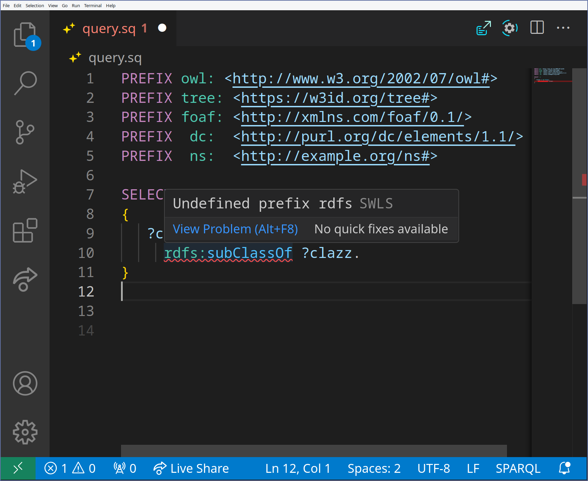
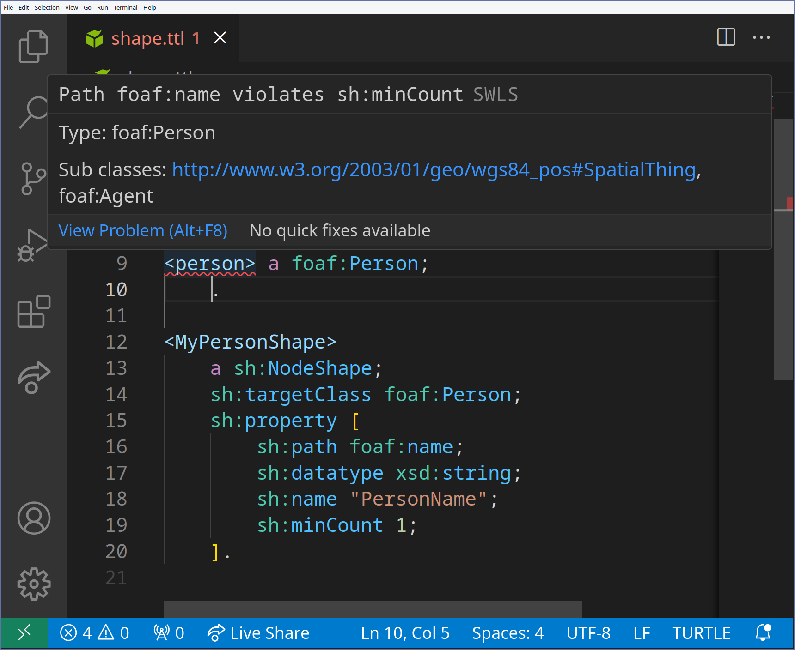
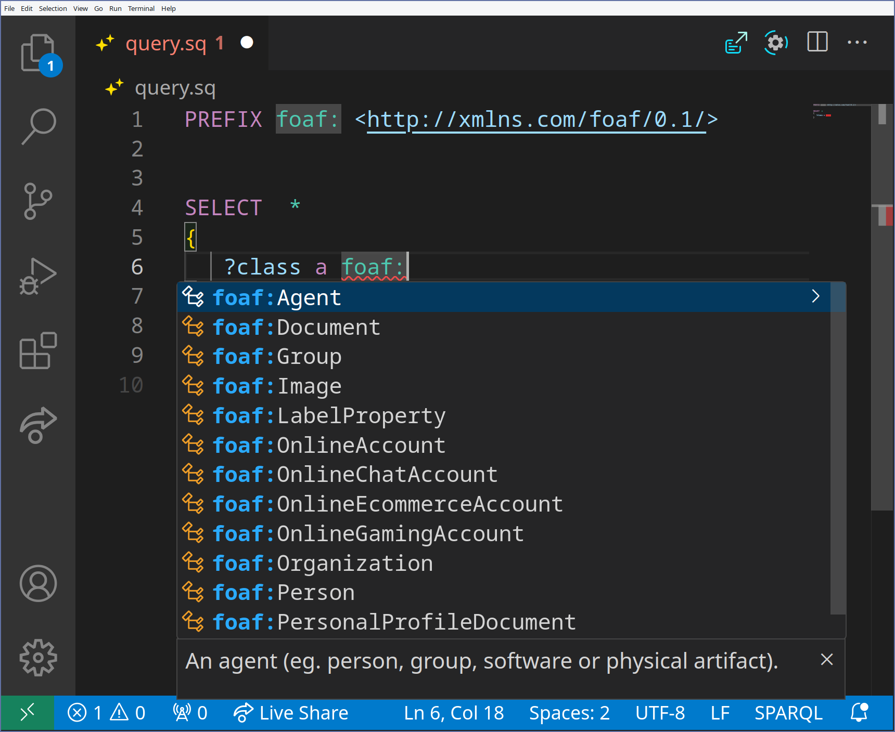

# Semantic Web Language Server

[](https://github.com/ajuvercr/semantic-web-lsp/actions/workflows/ci.yml)
[](https://ajuvercr.github.io/semantic-web-lsp/docs/lsp_core/index.html)

[](https://marketplace.visualstudio.com/items?itemName=ajuvercr.semantic-web-lsp)

This repo includes the source code for the semantic web language server.
The language server provides IDE like functionality for semantic web languages, including Turtle, JSON-LD and SPARQL.

A live demo can be found [online](https://ajuvercr.github.io/semantic-web-lsp/), built with monaco editors.

## Documentation

- [lsp-core](https://ajuvercr.github.io/semantic-web-lsp/docs/lsp_core/index.html)
- [lang-turtle](https://ajuvercr.github.io/semantic-web-lsp/docs/lang_turtle/index.html)
- [lang-jsonld](https://ajuvercr.github.io/semantic-web-lsp/docs/lang_jsonld/index.html)
- [lang-sparql](https://ajuvercr.github.io/semantic-web-lsp/docs/lang_sparql/index.html)
- [lsp-bin](https://ajuvercr.github.io/semantic-web-lsp/docs/lsp_bin/index.html)
- [lsp-web](https://ajuvercr.github.io/semantic-web-lsp/docs/lsp_web/index.html)


## Features

### Diagnostics

- Syntax diagnostics
- Undefined prefix diagnostics
- SHACL shape diagnostics

### Completion

- Prefix completion (just start writing the prefix, `foa` completes to `foaf:` and adding the prefix statement)
- Property completion (ordered according to domain)
- Class completion (when writing the object where the prediate is `a`)

### Hover

- Shows additional information about the entities like class

### Rename

- Rename terms local to the current file 

### Formatting

- Format Turtle

### Highlighting

- Enables semantic highlighting


## Use the LSP

Currently a fluwent install is possible for NeoVim and VSCode.
However the language server protocol enables swift integration into other editors.

### VS Code

Install the semantic web lsp extension ([vscode](https://marketplace.visualstudio.com/items?itemName=ajuvercr.semantic-web-lsp) or [open-vscode](https://open-vsx.org/extension/ajuvercr/semantic-web-lsp)).
The extension starts the lsp from WASM and starts the vscode LSP client.

### Jetbrains

A zip of the Jetbrains plugin is available with the latest releases.
To install the plugin you should download the zip (swls-1.1-SNAPSHOT.zip) and go to Settings (ctrl + alt + s) > Plugins > Gear > Install Plugin from Disk and select the file.
Currently the plugin checks the Github releases on each startup to check if the latest binary is installed, and installs the latest binary.
This is not very user friendly, certainly on low quality internet connections.

PRs are much appreciated on the Jetbrains plugin.

### NeoVim

To use the LSP you will always have to install the binary.
So do that first:

```
cargo install --git https://github.com/ajuvercr/semantic-web-lsp swls
```
Or locally
```
git clone https://github.com/ajuvercr/semantic-web-lsp.git
cargo install --path swls
```

Or download the latest binary from the Github releases.

Configure the LSP in NeoVim.

```lua
vim.api.nvim_create_autocmd("FileType", {
    pattern = { "turtle", "sparql", "jsonld" },
    callback = function()
        vim.lsp.start({
            name = "swls",
            cmd = { "swls" },
            root_dir = vim.fn.getcwd(),
        })
    end,
})
```

<details>
<summary>Instructions for configuring an autocmd to detect and assign filetypes automatically.</summary>

```lua
vim.api.nvim_create_autocmd({ "BufNewFile", "BufReadPost" }, {
    pattern = "*.ttl",
    callback = function(args)
        vim.bo[args.buf].filetype = "turtle"
        vim.bo.commentstring = "# %s"
    end,
})

vim.api.nvim_create_autocmd({ "BufNewFile", "BufReadPost" }, {
    pattern = { "*.sq", "*.rq", "*.sparql" },
    callback = function(args)
        vim.bo[args.buf].filetype = "sparql"
        vim.bo.commentstring = "# %s"
    end,
})

vim.api.nvim_create_autocmd({ "BufNewFile", "BufReadPost" }, {
    pattern = { "*.jsonld" },
    callback = function(args)
        vim.bo[args.buf].filetype = "jsonld"
    end,
})
```
</details>


## Screenshots

|Undefined prefix|Shape violation|
|---|---|
|  |  |

|Complete Class|Complete Property|
|---|---|
|  |  |
